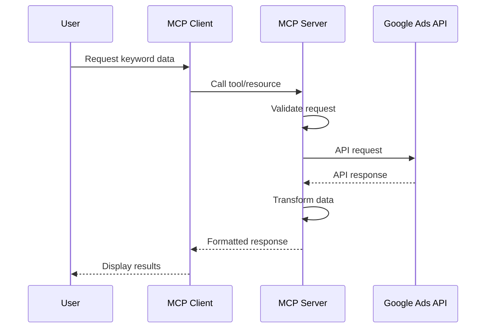

# Google Ads MCP Server Implementation Plan

## Project Overview

The Google Ads MCP Server is a Model Context Protocol implementation that provides seamless integration with Google Ads API for keyword research, campaign planning, and SEO optimization. This document outlines the implementation phases and current status.

## Implementation Phases

### Phase 1: Project Setup ✅ COMPLETED

**Objectives:**

- Initialize TypeScript project structure
- Configure dependencies and build system
- Set up environment configuration
- Create project file structure

**Deliverables:**

- `package.json` with all necessary dependencies
- `tsconfig.json` for TypeScript configuration
- Project directory structure following MCP guidelines
- `.gitignore` file for security

**Key Files Created:**

- `/package.json` - Project configuration and dependencies
- `/tsconfig.json` - TypeScript compiler configuration
- `/.gitignore` - Git ignore rules

### Phase 2: Authentication Layer ✅ COMPLETED

**Objectives:**

- Implement Google OAuth2 authentication
- Create token management system
- Add comprehensive error handling
- Build authentication service

**Deliverables:**

- Environment configuration with yargs
- Secure credential handling
- Error classes for authentication failures
- Support for both CLI args and environment variables

**Key Files Created:**

- `/src/config/env.ts` - Environment configuration and validation
- `/src/errors/environment-validation-error.ts` - Custom error for env validation
- `/src/errors/google-ads-api-error.ts` - Custom error for API failures

### Phase 3: API Integration ✅ COMPLETED

**Objectives:**

- Implement Google Ads client setup
- Create keyword service implementation
- Define API response types
- Add rate limiting handler

**Deliverables:**

- Google Ads API client wrapper
- Keyword idea generation functionality
- Historical metrics retrieval
- Automatic rate limiting and retry logic

**Key Files Created:**

- `/src/services/google-ads-client.ts` - Main API client implementation
- `/src/types/keyword-data.ts` - Keyword data type definitions
- `/src/types/keyword-idea-request.ts` - Request parameter types

### Phase 4: MCP Implementation ✅ COMPLETED

**Objectives:**

- Implement MCP tools for keyword operations
- Create MCP resources for reference data
- Build MCP prompts for AI assistance
- Integrate with MCP server

**Deliverables:**

- Two main tools: `generate-keyword-ideas` and `get-keyword-metrics`
- Four resources: location codes, language codes, match types, competition levels
- Four prompts: keyword research, metrics analysis, SEO optimization, PPC planning
- Complete server implementation with stdio and SSE transport

**Key Files Created:**

- `/src/tools/keyword-research-tool.ts` - Tool implementations
- `/src/tools/index.ts` - Tool registration
- `/src/resources/index.ts` - Resource definitions
- `/src/prompts/index.ts` - Prompt templates
- `/src/server.ts` - Main server implementation
- `/src/index.ts` - Entry point

### Phase 5: Testing & Documentation ✅ COMPLETED

**Objectives:**

- Create comprehensive documentation
- Set up MkDocs for documentation site
- Write API reference documentation
- Create usage examples and guides

**Deliverables:**

- Complete README.md with quick start guide
- MkDocs configuration and documentation structure
- Installation and authentication guides
- API reference documentation
- Implementation plan document

**Key Files Created:**

- `/README.md` - Main project documentation
- `/mkdocs.yml` - Documentation site configuration
- `/docs/index.md` - Documentation homepage
- `/docs/getting-started/installation.md` - Installation guide
- `/docs/getting-started/authentication.md` - Authentication setup
- `/docs/api/tools.md` - Tools API reference

## Technical Architecture

### Core Components

1. **Authentication System**

    - OAuth2 credential management
    - Environment variable support
    - Command-line argument parsing
    - Secure token handling

2. **API Integration Layer**

    - Google Ads API client wrapper
    - Request/response type definitions
    - Rate limiting and retry logic
    - Error handling and reporting

3. **MCP Server Implementation**
    - Tools for keyword operations
    - Resources for reference data
    - Prompts for AI assistance
    - Transport support (stdio/SSE)

### Data Flow



## API Capabilities

### Tools

1. **generate-keyword-ideas**

    - Generate ideas from seed keywords
    - Extract keywords from URLs
    - Support for multiple languages and locations
    - Configurable result size

2. **get-keyword-metrics**
    - Retrieve search volume data
    - Get competition metrics
    - Access CPC estimates
    - View 12-month trends

### Resources

1. **location-codes** - Reference for geographic targeting
2. **language-codes** - Supported language codes
3. **keyword-match-types** - Google Ads match type guide
4. **competition-levels** - Competition level explanations

### Prompts

1. **keyword-research-strategy** - Strategic planning assistance
2. **analyze-keyword-metrics** - Data analysis and recommendations
3. **seo-content-optimization** - Content optimization guidance
4. **ppc-campaign-structure** - Campaign structure planning

## Configuration Options

The server supports extensive configuration through:

- Command-line arguments
- Environment variables
- Configuration precedence (CLI > ENV)

Key configurations:

- Google Ads API credentials
- Rate limiting parameters
- Transport mode (stdio/SSE)
- API version selection

## Security Considerations

1. **Credential Management**

    - No hardcoded credentials
    - Support for environment variables
    - Secure token storage recommendations

2. **API Access Control**

    - Read-only operations by default
    - Customer ID validation
    - Rate limiting protection

3. **Error Handling**
    - No credential leakage in errors
    - User-friendly error messages
    - Detailed logging for debugging

## Future Enhancements

### Potential Phase 6 Features

1. **Advanced Analytics**

    - Keyword clustering
    - Trend prediction
    - Competitive gap analysis

2. **Campaign Management**

    - Ad group creation
    - Bid management tools
    - Performance tracking

3. **Reporting Tools**

    - Export to CSV/Excel
    - Custom report generation
    - Scheduled reports

4. **Integration Improvements**
    - Webhook support
    - Batch processing
    - Caching layer

## Usage Instructions

### Installation

```bash
# From npm (when published)
npm install -g @monsoft/mcp-google-ads

# From source
git clone <repository>
cd packages/mcp-google-ads
npm install
npm run build
```

### Configuration

```bash
# Set environment variables
export GOOGLE_ADS_CLIENT_ID="..."
export GOOGLE_ADS_CLIENT_SECRET="..."
export GOOGLE_ADS_DEVELOPER_TOKEN="..."
export GOOGLE_ADS_REFRESH_TOKEN="..."
export GOOGLE_ADS_CUSTOMER_ID="..."

# Run the server
mcp-google-ads
```

### Integration with MCP Clients

For Claude Desktop or other MCP clients, add to configuration:

```json
{
    "mcpServers": {
        "google-ads": {
            "command": "mcp-google-ads",
            "args": ["--client-id", "...", "--client-secret", "..."]
        }
    }
}
```

## Development Status

- ✅ Core functionality implemented
- ✅ Authentication system complete
- ✅ API integration working
- ✅ MCP protocol fully implemented
- ✅ Documentation completed
- ⏳ Ready for testing and deployment

## Next Steps

1. **Testing Phase**

    - Unit tests for core functionality
    - Integration tests with Google Ads API
    - End-to-end MCP protocol tests

2. **Deployment**

    - Publish to npm registry
    - Create Docker image
    - Set up CI/CD pipeline

3. **Community**
    - Create usage examples
    - Write blog posts
    - Gather user feedback

---

This implementation provides a solid foundation for Google Ads integration through the Model Context Protocol, enabling AI assistants to perform sophisticated keyword research and campaign planning tasks.
