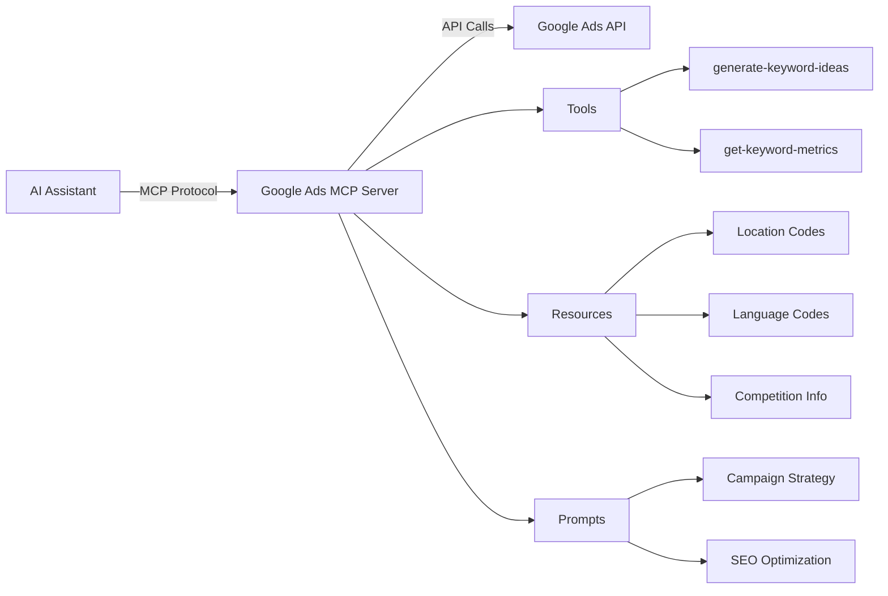

# Google Ads MCP Server

A Model Context Protocol (MCP) server that provides seamless integration with Google Ads API for keyword research, campaign planning, and SEO optimization.

## Overview

The Google Ads MCP Server enables AI assistants to interact with Google Ads API through a standardized protocol, providing access to powerful keyword planning tools and advertising insights. This server implements the MCP specification to offer tools, resources, and prompts for comprehensive keyword research and campaign management.

## Key Features

- **🔍 Keyword Research**: Generate keyword ideas from seed keywords or URLs
- **📊 Metrics Analysis**: Get search volume, competition data, and CPC estimates
- **🌍 Geographic Targeting**: Support for location-based keyword research
- **🗣️ Multi-language Support**: Research keywords in multiple languages
- **💰 Budget Planning**: CPC estimates and competition analysis
- **🎯 Smart Prompts**: Pre-built prompts for campaign strategy and SEO
- **📈 Historical Data**: Access to 12-month search trend data

## Architecture



## Use Cases

### 1. Website Keyword Planning

Research and analyze keywords for website optimization, content strategy, and SEO campaigns.

### 2. PPC Campaign Development

Plan and structure Google Ads campaigns with keyword grouping, budget allocation, and bid strategies.

### 3. Competitive Analysis

Analyze keyword competition levels and identify opportunities in your market.

### 4. Content Optimization

Get keyword suggestions and search intent analysis for content creation and optimization.

### 5. Market Research

Understand search trends and user behavior in different geographic locations and languages.

## Quick Example

```typescript
// Generate keyword ideas from seed keywords
const ideas = await mcp.callTool('generate-keyword-ideas', {
    keywords: ['running shoes', 'athletic footwear'],
    languageCode: 'en',
    locationCodes: ['1009'], // USA
    pageSize: 50,
});

// Get detailed metrics for specific keywords
const metrics = await mcp.callTool('get-keyword-metrics', {
    keywords: ['best running shoes', 'marathon training shoes'],
    languageCode: 'en',
    locationCodes: ['1009'],
});
```

## Requirements

- Node.js 18 or higher
- Google Ads API access credentials
- Google Cloud project with Ads API enabled
- Valid customer ID for Google Ads account

## Getting Started

Ready to integrate Google Ads capabilities into your AI assistant? Head over to the [Installation Guide](getting-started/installation.md) to get started!

## Support

For issues, questions, or contributions:

- GitHub Issues: [Report a bug](https://github.com/Monsoft-Solutions/model-context-protocols/issues)
- Documentation: [View on GitHub](https://github.com/Monsoft-Solutions/model-context-protocols)

---

Built with ❤️ by [Monsoft Solutions](https://monsoftsolutions.com)
